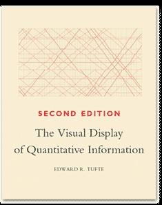
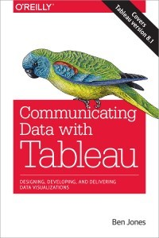

### DSCI 310: Data summarization and visualization
### Fall 2017
### INSTRUCTOR: Dr. Silas Bergen
### OFFICE: Gildemeister 124D
### [Office hours](Schedule.html)

### Course overview
The amount and extent of data in our world is growing extremely rapidly. 
As such there is an increasing need for analysts skilled in summarizing data. 
Visualizations are an immensely popular way of summarizing data, as they allow viewers to efficiently translate data into information. 
Modern visualizations are either static or interactive, with a growing trend towards the latter. 
In this course we will discuss how we perceive information visually, how to identify and avoid data visualization pitfalls, 
and how to create effective static and interactive visualizations.

### Prerequisites
Data Science 210. In DSCI 310 I will assume you have working knowledge of data management tools and techniques. 
Some tasks in DSCI 310 will require a nontrivial amount of data manipulation and cleaning. 
While I will provide support for this as needed, I will expect you to be able to obtain and "wrangle" some data on your own. 
Examples of data tasks that you should be able to do include reshaping data between wide and long formats.

### Textbook
There is no required textbook for this course. 
Highly recommended resources are The Visual Display of Quantitative Information by Edward Tufte, and Communicating Data with Tableau by Ben Jones. 

Tufte |   Jones
:-------------------------:|:-------------------------:
  |  

We will be looking at examples from these texts over the duration of the semester.

  

### Software
We will be using the Tableau software (latest version: 10.2 as of Fall 2017) extensively throughout this semester.
Tableau is quickly becoming the industry standard for data visualization, 
as its drag-and-drop user interface is accessible to people who may be uncomfortable with command-line coding. 
It is also a powerful way to interact with data through the creation of dashboards. Tableau Desktop 10.0 is not usually free, but is available to you as students through the WSU network. We will be uploading vizzes onto Tableau Public, which is free to anybody. Time permitting we will also cover the R package ggplot2. This is the standard for graphics within R, and is better suited for static statistical graphics than Tableau.

### Learning outcomes
* Students will be able to identify and describe the methods and techniques commonly used to describe data both numerically and visually.
* Students will be able to use appropriate methods to summarize and visualize data based upon the data type and the goals of the analysis.
* Students will be able to demonstrate the ability to clean and prepare data for the summarization and visualization process.
* Students will demonstrate the ability to summarize and visualize relationships between variables appropriately given the data type of the variables involved.
* Students will be able to construct an interactive data dashboard to summarize and display the important features of a data set.

### Assessments

* Attendance and participation (10%)

>DSCI 310 will be heavy on in-class discussion and visualization designs. 
It is important that all students are a part of these discussions. 
There will also be many in-class data visualization activities in which it is important for you to participate.
 Accordingly, I will take attendance almost every day throughout the semester and it will be weighted at 10% of your final grade.

* Visualization critiques (15%)

 >Students will be required to submit frequent critiques of assigned visualizations. 
At the beginning of the semester, critiques will mostly be of visualizations I provide you. 
As the semester progresses, you will also critique your peers' visualizations using the peer grading resouce [CrowdGrader](https://www.crowdgrader.org/). 
Becoming an effective critic is imperative for your own growth as a visualization designer; 
hence completing thorough critiques is a non-trivial component of your final grade. 
I will provide you with a rubric to use when you critique your peers' visualizations.

* Exam (10%)

 >There will be one exam in this course, covering visual theory and best practices as well as visualization creation. 
The exam will assess students’ abilities to critique visualizations, and suggest improvements, by applying perceptual theory and other concepts covered in class.

* Design tasks (15%)

>There will be frequent design tasks where students will be presented with a data set and asked to create a viz summarizing important aspects of the data set. 
Some design tasks will come with their own questions of interest, while others may require the student to explore the data in order to find and visualize their own 
questions of interest. Some design tasks may require a nontrivial amount of data wrangling to get the data into a format suitable for visualizing. 
All design tasks will include an editing process during which your visualization is critiqued by at least 2 peers and you will have a chance to edit your 
visualization as a result of these critiques.

* Midterm group project (20%)

>There will be one midterm group project at various points in the semester. This projects will consist of oral presentations of the projects to the entire class.

* Final project (30%)

>Each student will be required to find their own data set and visualize it using a series of interactive Dashboards. 
Each student will prepare a presentation for the class providing the context of their data set, questions posed by the data, 
and visualizations that communicate the answers to those questions. The data set and a set of preliminary questions must be approved by the instructor.

### Tentative course topics
1.	Principles of effective data visualization   

>* Historical background and examples    
>* How we perceive information: Elementary perceptual tasks (EPT)    
>* What makes a strong graphic?    
>* What makes a poor graphic?  
>* Designing for aesthetic  
>* Data Type (categorical, ordinal, continuous)  
>* Matching data type to the appropriate EPT  

2.	Visualizing univariate data 

>* Visualization techniques for single categorical field 
>* Visualization techniques for single quantitative field 

3.	Visualizing multivariate data  

>* Mosaic and stacked bar charts   
>* Time-series plots  
>* 2- and 3-way Scatterplots  

4.	Visualizing aggregated data

>* Rates  
>* Ratios  

5.	Visualizing spatial data

>* Filled maps  
>* Shape-size maps  

6.	Data Dashboards

>* The power of interaction  
>* Interaction via filter  
>* Interaction via parameterization  
>* View filtering  
